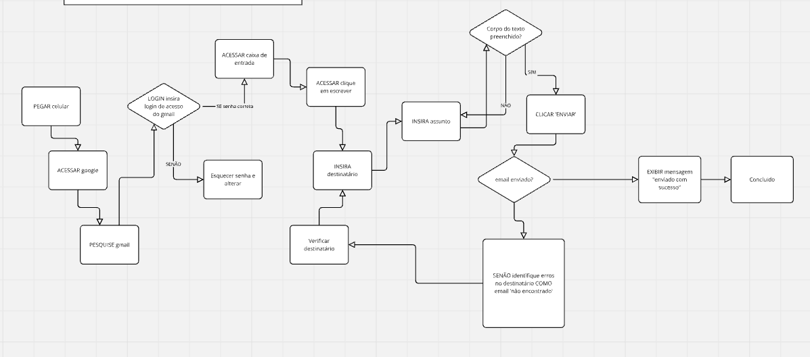

### Pseudocogigo e Fluxograma
INICIO
// PASSO 1: PEGAR celular
ACESSAR google.
PESQUISE gmail.
LOGIN insira login de acesso do gmail
SE senha estiver correta ACESSAR caixa de entrada
SENÃO esquecer senha e alterar

//PASSO 2: ACESSAR clique em escrever INSIRA destinatário
INSIRA assunto

// PASSO 3: APOS corpo do texto estive preenchido CLICAR "ENVIAR" SE enviar sinalizar com mensagem "enviado com sucesso) SENÃO verificar destinatário, INDENTIFIQUE erros no destinatário COMO email "não encontrado"

---

## 🗺️ Fluxograma

O fluxograma a seguir representa o processo descrito acima, desde o acesso ao Gmail até o envio do e-mail:

---

## ✅ Objetivo da Atividade

- Desenvolver o raciocínio lógico com base em **etapas sequenciais**.
- Identificar **condições** e **decisões** dentro de um processo.
- Aprender a representar fluxos usando **pseudocódigo** e **diagramas visuais**.

---

