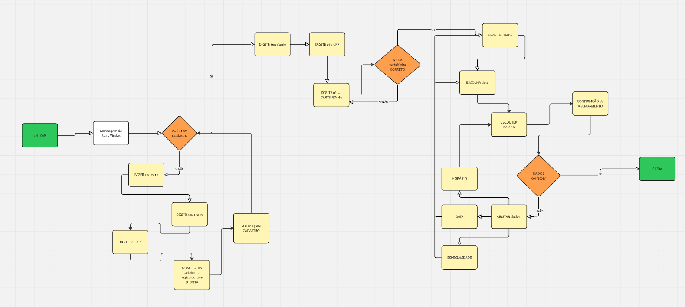
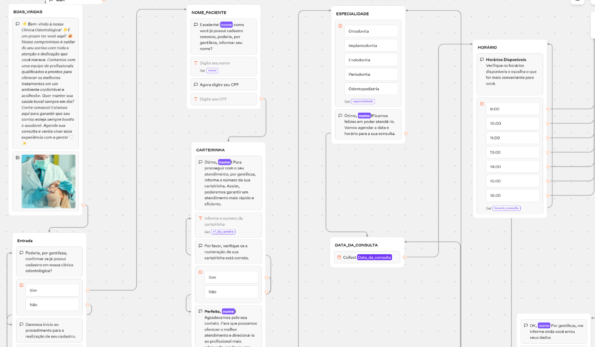

# 🤖 Chatbot - Aula de Typebot

Nesta aula exploramos o uso da ferramenta **Typebot** para criação de chatbots interativos, com foco em planejamento de fluxo de conversação e experiência do usuário.

---

## 🧠 O que foi aprendido?

- Conceito de chatbot e suas aplicações.
- Planejamento de fluxos de conversas com decisões (if/else).
- Uso de ferramentas visuais para desenvolvimento de interfaces sem código.
- Criação de chatbot usando a plataforma **Typebot**.

---

## 🗺️ Fluxograma do Chatbot

O fluxograma abaixo representa o planejamento da estrutura de decisões e interações do chatbot:

---

## 🦷 Simulação: Chatbot para Clínica Odontológica

Foi desenvolvida uma simulação de chatbot com foco no atendimento inicial de uma **clínica odontológica**, permitindo agendamentos, informações de contato e orientações ao paciente.

🔗 **Acesse o chatbot clicando aqui:**  
👉 [Acessar Chatbot no Typebot](https://typebot.co/my-typebot-24019ac)

---

## 🛠️ Ferramenta Utilizada

- [Typebot](https://typebot.io) – Plataforma visual para criação de chatbots sem necessidade de programação.

---

## 💡 Dica

Use fluxogramas bem planejados para garantir uma navegação clara e intuitiva para o usuário. Isso facilita a construção do chatbot e melhora a experiência final!
